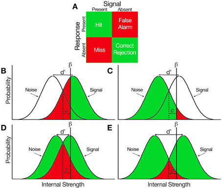

# Signal Detection
Applying Signal Detection Theory to differentiate between a target signal and noise
|               | Really signal | Really noise |
| ------------- | ------------- |
| Detect signal    | hit | false alarm |
| Detect no signal | miss | correct rejection |

Cognitive Theory: it assumes there is a discrete continuum on which stimuli are experienced (either you do or do not experience them)
- discriminability variable characterizes how easy it is to separate signal from noise (how much overlap?) 
- K criterion is the decision boundary to decide if a signal is present
- Bias of the criterion is measured as the difference between detect and no detection curves at the decision boundary
 
The posterior prediction distribution is used to update descriptions of unobserved, new data based on new data introduced. This is 
used to update characterization of predicted future data but not to actually make those predictions.
 
Side note: concave points in a shape carry more significance because we automatically assume all shapes have convex curves (ex: triangle, square).
This makes concavity in objects more easy to detect